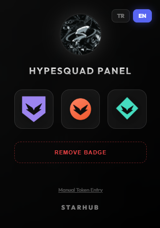

# 🌟 StarHUB Discord HypeSquad Manager

A modern and sleek Google Chrome / Microsoft Edge extension that allows you to change your Discord HypeSquad badge (Bravery, Brilliance, Balance) with a single click or remove it completely.

> **Note:** The extension only requires Discord (`discord.com/app`) to be open in a background tab to work. It automatically finds your token and does not ask for any codes or passwords!

## ✨ Features

* 🚀 **One-Click Badge Change:** Switch to any house instantly.
* 🗑️ **Badge Removal:** Option to completely remove the HypeSquad badge from your account.
* 🔑 **Advanced Auto-Token Grabber:** The era of pasting codes into the console (F12) is over! The extension automatically finds and uses your token via a secure "MAIN world" injection from your Discord tab.
* 🌌 **Futuristic Modern Interface:** StarHUB themed; featuring a glassmorphism effect, dark mode compatibility, and high-quality animations.
* 🌍 **Multi-Language Support:** Switch between English (EN) and Turkish (TR) interfaces with a single click.

## 📸 Screenshots

*(You can add your extension screenshots uploaded to GitHub here)*
> 

## 🛠️ Installation Guide (Developer Mode)

Since this extension is not on the Chrome Web Store, it must be installed manually. It only takes 1 minute:

1. Download this repository as a **ZIP** (`Code` > `Download ZIP`) and extract it to a folder.
2. Go to the extensions page in your browser (Chrome or Edge):
   * For Chrome, type this in the address bar: `chrome://extensions/`
3. Toggle the **"Developer mode"** switch in the top right corner to ON.
4. Click the **"Load unpacked"** button that appears in the top left.
5. Select the folder you extracted from the ZIP.
6. The extension is installed! You can pin it from the puzzle (🧩) icon in the top right.

## 📖 How to Use?

1. Open a new tab in your browser, go to **[Discord Web](https://discord.com/app)**, and make sure you are logged into your account.
2. Open the panel by clicking our extension icon in the top right.
3. Click on the HypeSquad badge (Purple, Red, Turquoise) you want to get.
4. When you see the green "Success!" text at the bottom, the process is complete. Refresh your Discord tab (**Ctrl + R**) to see the change.

## ⚠️ Legal Disclaimer

This project is developed entirely for **educational and practical purposes**. Sending external requests to the Discord API (Self-botting or API manipulation) may violate Discord's Terms of Service (TOS). The **user is solely responsible** for any risk of account suspension/penalty that may arise from using this extension. No personal data or Tokens are exported outside the extension or saved anywhere.

## 👨‍💻 Developer & Community

This project is specially designed for the **StarHUB** community. 
To join us: [StarHUB Discord Server](https://discord.gg/starhub)
